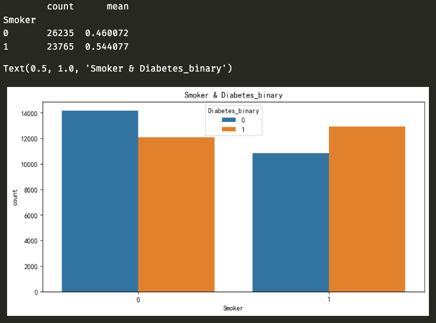

<center><h1> 糖尿病预测 </h1></center>

<center> 2023年江南大学机器学习期末大作业。 </center>

## 问题描述

<details><summary></summary>

### Overview

糖尿病是一种严重的慢性疾病，患者失去了有效调节血液中葡萄糖水平的能力，并可能导致生活质量和预期寿命下降。不同的食物在消化过程中分解成糖后，这些糖就会释放到血液中。这是胰腺释放胰岛素的信号。胰岛素有助于体内细胞利用血液中的这些糖获取能量。糖尿病的特征通常是身体不能产生足够的胰岛素，或者不能有效地使用所需的胰岛素。

心脏病、视力下降、下肢截肢和肾脏疾病等并发症与糖尿病患者血液中长期高水平的糖分有关。虽然糖尿病没有治愈方法，但减肥、健康饮食、积极活动和接受药物治疗等策略可以减轻这种疾病对许多患者的危害。早期诊断可以改变生活方式和更有效的治疗，使糖尿病风险预测模型成为公共和公共卫生官员的重要工具。

### Description


本项目将提供一个糖尿病数据集data.csv，包含70692份糖尿病调查样本，每个样本有21个特征。数据集中包括两个类别，两个类别的样本数量平衡：

- 0：表示无糖尿病
- 1：表示糖尿病前期或糖尿病。

注意：数据集中第一列就是样本类别标签。

要求广泛调研，选择合适的模型，基于各种指标对糖尿病进行预测。

### Evaluation

#### 评价指标 Precision Score

本次比赛的评价指标为Precision Score。Precision Score表征了测试集中预测正确的百分比。

#### 提交格式


提交文件中比赛包括两列：id 和 label. id是样本编号，label是预测的结果，其中0表示无糖尿病，1表示表示糖尿病前期或糖尿病。提交文件以CSV格式存储，用逗号分隔每列。

提交文件格式示例：

```text
id,label
1,1
2,1
3,0
4,0
5,1
……
257,1
258,0
```

</details>


## 问题求解

<details><summary></summary>


### 实验目的

通过本次大作业，要求学生掌握数据预处理、数据建模、数据分析等完整的数据分析过程，旨在使学生了解机器学习的研究对象、研究内容、研究方法（包括理论基础和实验方法），和近年来的主要发展技术路线。培养学生以机器学习理论为基础从事相关应用研究的能力。

### 实验内容

要求针对提供的学生数据，进行各指标评价。
本次大作业将提供7万多张糖尿病调查样本。其中50000作为训练样本，20692个作为测试样本，每个样本包括21个特征。样本类别均衡。要求每位同学根据提供的数据，设计机器学习模型，自动诊断糖尿病。

### 运行环境

- 通过 conda 构建运行环境：conda create --name ml python=3.9 -y
- 激活 conda 环境：conda activate ml
- pip install -r requirments.txt
    - numpy
    - pandas
    - seaborn
    - matplotlib
    - scikit-learn
    - torch
    - torchvision
    - torchaudio


### 数据预处理

#### 读取数据

- 读取数据

```python
train = pd.read_csv('./dataset/train.csv')
test = pd.read_csv('./dataset/test_withoutLable.csv')
```

- 输出训练集和测试集的大小

```python
print("train.shape:", train.shape, "test.shape:", test.shape)
```

- 训练集和预测集的摘要信息

```python
print("训练集的摘要信息")
train.info()
print("数据集的摘要信息")
test.info()
```

通过结果发现，数据中并无缺失部分，并且类型都为int64，没有str类型，这为后续的数据预处理提供方便。

#### 特征分析
分析样本的糖尿病情况，因此主要分析特征 Diabetes_binary 和其他特征的关系。


- HighBP 对 Diabetes_binary 的分析


数据表明 HighBP 为 1 的样本数量为 28165，其中有糖尿病的样本数量占比 66.76%，HighBP 为 0 的样本数量 21835，其中有糖尿病的样本数量占比 28.37%。
即 HighBP 对糖尿病有关

- HighChol 对 Diabetes_binary 的分析


数据表明 HighChol 为 1 的样本数量为 26303，其中有糖尿病的样本数量占比 63.73%，HighChol 为 0 的样本数量 21835，其中有糖尿病的样本数量占比 28.37%。
即 HighChol 对糖尿病有关


- CholCheck 对 Diabetes_binary 的分析


数据表明 CholCheck 为 1 的样本数量为 48773，其中有糖尿病的样本数量占比 50.88%，CholCheck 为 0 的样本数量 1227，其中有糖尿病的样本数量占比 14.66%。
即 CholCheck 对糖尿病基本无关


- BMI 对 Diabetes_binary 的分析


数据表明 BMI 超过 27（包括 27） 中有糖尿病的样本数量比没有糖尿病的样本数量多， BMI 为 27 以下的样本数量中有糖尿病的样本数量比没有糖尿病的样本数量多。
即 BMI 在27之后对糖尿病有关

- Smoker 对 Diabetes_binary 的分析



数据表明 Smoker 为 1 的样本数量为 23765，其中有糖尿病的样本数量占比 54.40%， Smoker 为 0 的样本数量 26235，其中有糖尿病的样本数量占比 46.00%。
即 Smoker 对糖尿病有关

-  Stroke 对 Diabetes_binary 的分析


数据表明 Stroke 为 1 的样本数量为 3103，其中有糖尿病的样本数量占比 74.60%， Stroke 为 0 的样本数量 46897，其中有糖尿病的样本数量占比 48.37%。
即 Stroke 对糖尿病有关

- HeartDiseaseorAttack 对 Diabetes_binary 的分析


数据表明 HeartDiseaseorAttack 为 1 的样本数量为 7416，其中有糖尿病的样本数量占比 75.04%， HeartDiseaseorAttack 为 0 的样本数量 42584，其中有糖尿病的样本数量占比 45.63%。
即 HeartDiseaseorAttack 对糖尿病有关

- PhysActivity 对 Diabetes_binary 的分析


数据表明 PhysActivity 为 1 的样本数量为 35125，其中有糖尿病的样本数量占比 44.92%， PhysActivity 为 0 的样本数量 14875，其中有糖尿病的样本数量占比 61.97%。
即 PhysActivity 对糖尿病有关

- Fruits 对 Diabetes_binary 的分析


数据表明 Fruits 为 1 的样本数量为 30587，其中有糖尿病的样本数量占比 47.87%， Fruits 为 0 的样本数量 19413，其中有糖尿病的样本数量占比 53.34%。
即 Fruits 对糖尿病关系不明显

- Veggies 对 Diabetes_binary 的分析


数据表明 Veggies 为 1 的样本数量为 39386，其中有糖尿病的样本数量占比 47.89%， Veggies 为 0 的样本数量 10614，其中有糖尿病的样本数量占比 57.80%。
即 Veggies 对糖尿病有关

- HvyAlcoholConsump 对 Diabetes_binary 的分析


数据表明 HvyAlcoholConsump 为 1 的样本数量为 2095，其中有糖尿病的样本数量占比 27.63%， HvyAlcoholConsump 为 0 的样本数量 47905，其中有糖尿病的样本数量占比 50.97%。
即 HvyAlcoholConsump 对糖尿病关系不明显

- AnyHealthcare 对 Diabetes_binary 的分析


数据表明 AnyHealthcare 为 1 的样本数量为 47718，其中有糖尿病的样本数量占比 50.26%， AnyHealthcare 为 0 的样本数量 2282，其中有糖尿病的样本数量占比 44.43%。
即 AnyHealthcare 对糖尿病关系不明显

- NoDocbcCost 对 Diabetes_binary 的分析


数据表明 NoDocbcCost 为 1 的样本数量为 4764，其中有糖尿病的样本数量占比 56.80%， NoDocbcCost 为 0 的样本数量 45236，其中有糖尿病的样本数量占比 49.28%。
即 NoDocbcCost 对糖尿病几乎无关

- GenHlth 对 Diabetes_binary 的分析


数据表明 GenHlth 在 [3,5] 之间的糖尿病样本数量占比更大，在 [1,2] 之间的占比较小
即 GenHlth 对糖尿病有关

- MentHlth 对 Diabetes_binary 的分析


数据表明 MentHlth 基本集中在 0 处，并且糖尿病样本数量占比均衡，但是在 30 处的占比很大
即 MentHlth 对糖尿病有关

- PhysHlth 对 Diabetes_binary 的分析


数据表明 PhysHlth 基本集中在 0 处，并且糖尿病样本数量占比均衡，但是在 30 处的占比很大
即 PhysHlth 对糖尿病有关

- DiffWalk 对 Diabetes_binary 的分析


数据表明 DiffWalk 为 1 的样本数量为 12691，其中有糖尿病的样本数量占比 73.50%， DiffWalk 为 0 的样本数量 37309，其中有糖尿病的样本数量占比 42.00%。
即 DiffWalk 对糖尿病有关

- Sex 对 Diabetes_binary 的分析


数据表明 Sex 为 1 的样本数量为 22941，其中有糖尿病的样本数量占比 52.43%， Sex 为 0 的样本数量 27059，其中有糖尿病的样本数量占比 47.93%。
即 Sex 对糖尿病关系不明显

- Age 对 Diabetes_binary 的分析


数据表明 Age 在 [8,13] 之间糖尿病样本数量占比大，其他区间占比较小
即 Age 之间对糖尿病有关

- Education 对 Diabetes_binary 的分析


数据表明 Education 在 [1,5] 之间糖尿病样本数量占比较大，其他区间占比较小
即 Education 对糖尿病有关

- Income 对 Diabetes_binary 的分析


数据表明 Income 在 [1，6] 之间糖尿病样本数量占比较大，其他区间占比较小
即 Income 对糖尿病有关

#### 相关性分析

采用特征的皮尔逊相关系数图


### 特征提取与数据建模（实验可以采用多种方法）

- 通过数据预处理后决定舍弃部分与 Diabetes_binary 相关性不大的特征，即

```python
drop(['Sex', 'NoDocbcCost', 'AnyHealthcare', 'HvyAlcoholConsump', 'Veggies', 'Fruits', 'CholCheck'])
```


- 读取数据后将训练集进行数据切割，分成训练集：测试集=4:1

```python
train_data, test_data, train_label, test_label = train_test_split(diabetes_train_data_X, diabetes_train_data_Y, test_size=0.2)  
```

- 为了找出最合适的模型，将 sklearn 库中的各个模型进行对比，具体选择的模型有
    - K近邻
    - 逻辑回归
    - 决策树
    - 随机森林
    - 梯度提升
    - 支持向量机
    - 深度学习


### 实验设计（具体模型和参数，样本的预处理等等所有与实验相关的工作都可以在这里体现，着重体现你如何提高分类精度）

用 classifiers 汇总不同模型的算法，部分算法采用归一化的方式提高精度，并将结果保存起来，用图像显示如下：


|     | score  | algorithm |
| --- | ------ | --------- |
| 0   | 0.7203 | knn       |
| 1   | 0.7485 | log_reg   |
| 2   | 0.7438 | tree      |
| 3   | 0.7363 | rf        |
| 4   | 0.7588 | gb        |
| 5   | 0.7542 | svc       |
| 6   | 0.7661 | mlp       |


通过对比，最终选择深度学习为最终的模型，用 pytorch 框架搭建神经网络进行深度学习。
6.1 读取数据并封装成dataset和dataLoader
读取数据、分割数据、numpy 转成 tensor，封装成dataset和dataLoader。

dataLoader的batch_size 设置为64，并将训练集的数据打乱。

```python
train_data = pd.read_csv('./dataset/train.csv')  
predict_data = pd.read_csv('./dataset/test_withoutLable.csv')  
  
diabetes_train_data_X = train_data.drop(['ID', 'Diabetes_binary', 'Sex', 'NoDocbcCost', 'AnyHealthcare', 'HvyAlcoholConsump', 'Veggies', 'Fruits', 'CholCheck'], axis=1)  
diabetes_train_data_Y = train_data['Diabetes_binary']  
diabetes_predict_data = predict_data.drop(['ID', 'Sex', 'NoDocbcCost', 'AnyHealthcare', 'HvyAlcoholConsump', 'Veggies', 'Fruits', 'CholCheck'], axis=1)  
  
train_data, test_data, train_label, test_label = train_test_split(diabetes_train_data_X, diabetes_train_data_Y, test_size=0.2)  
  
train_data = torch.from_numpy(train_data.values).float()  
train_label = torch.from_numpy(train_label.values).float()  
test_data = torch.from_numpy(test_data.values).float()  
test_label = torch.from_numpy(test_label.values).float()  
predict_data = torch.from_numpy(diabetes_predict_data.values).float()  
  
train_dataset = TensorDataset(train_data, train_label)  
test_dataset = TensorDataset(test_data, test_label)  
  
trainLoader = DataLoader(dataset=train_dataset, batch_size=64, shuffle=True, num_workers=1)  
testLoader = DataLoader(dataset=test_dataset, batch_size=64, shuffle=False, num_workers=1)  
```


#### 初步构建神经网络
神经网络一共有4层，中间层的激活函数采用ReLU(),最后一层的激活函数采用Softmax()，最后网络如下所示：

```text
1.Net(  
2.  (fc): Sequential(  
3.    (0): Linear(in_features=14, out_features=32, bias=True)  
4.    (1): ReLU()  
5.    (2): Linear(in_features=32, out_features=16, bias=True)  
6.    (3): ReLU()  
7.    (4): Linear(in_features=16, out_features=8, bias=True)  
8.    (5): ReLU()  
9.    (6): Linear(in_features=8, out_features=2, bias=True)  
10.    (7): Softmax(dim=1)  
11.  )  
12.)  
```

#### 损失函数和优化器

```python
criterion = torch.nn.CrossEntropyLoss() # 损失函数
optimizer = torch.optim.SGD(net.parameters(), lr=0.01) # 优化器
```

采用 CrossEntropyLoss() 为损失函数，SGD为优化器，并设置学习率为 0.01。


#### 模型训练

```python
start = time.time()
net.train()
for epoch in range(20):
    running_loss = 0.0
    for i, data in enumerate(trainLoader, 0):
        inputs, labels = data # 获取数据
        optimizer.zero_grad() # 梯度清零

        outputs = net(inputs)
        loss = criterion(outputs, labels.long())
        loss.backward() # 反向传播
        optimizer.step() # 更新梯度
        running_loss += loss.item()
        if i % 20 == 19:
        print('[%d, %5d] loss: %.5f' % (epoch+1, i+1, running_loss/2000))
        running_loss = 0.0

print('Finished Training, Total cost time: ', time.time()-start)
```


#### 模型验证

将训练好的模型对测试集进行训练，得出精确度。

```python
correct = 0
total = 0

with torch.no_grad():
for data in testLoader:
inputs, labels = data
outputs = net(inputs)
_, predicted = torch.max(outputs, 1)
total += labels.size(0)
correct += (predicted == labels.long()).sum().item()

print('Accuracy of the network on the 8000 train images: %.5f %%' % (100 * correct / total))
```

最终的精度为 72.63%，说明神经网络的模型还不够好，需要重新设计神经网络。


#### 扩展神经网络

由于初步设置的神经网络只有四层，并且最高维度只达到32，之后也尝试过64，最终经过多次测试后，发现升维到128的精度最佳，并用Dropout(p=0.1)进行优化，网络如下：

```text
1.Net(  
2.  (fc): Sequential(  
3.    (0): Linear(in_features=14, out_features=64, bias=True)  
4.    (1): ReLU()  
5.    (2): Linear(in_features=64, out_features=128, bias=True)  
6.    (3): Dropout(p=0.1, inplace=False)  
7.    (4): ReLU()  
8.    (5): Linear(in_features=128, out_features=64, bias=True)  
9.    (6): Dropout(p=0.1, inplace=False)  
10.    (7): ReLU()  
11.    (8): Linear(in_features=64, out_features=16, bias=True)  
12.    (9): ReLU()  
13.    (10): Linear(in_features=16, out_features=8, bias=True)  
14.    (11): ReLU()  
15.    (12): Linear(in_features=8, out_features=2, bias=True)  
16.    (13): Softmax(dim=1)  
17.  )  
18.)  
```

通过训练后，最高可达到的精度为75%。

#### 混淆矩阵


### 实验结果与分析

上面已经将模型搭建好并训练，由于训练的次数过多会导致过拟合，训练次数过少会导致欠拟合，所以选择epoch为80-100为最佳。最终对预测集进行预测

```python
net.eval()  
with torch.no_grad():  
        outputs = net(predict_data)  
        _, predicted = torch.max(outputs, 1)  
        predicted = predicted.numpy()  
  
submission = pd.read_csv('./dataset/test_withoutLable.csv')  
submission = submission[['ID']]  
submission['Diabetes_binary'] = predicted  
submission.to_csv('./dataset/submission.csv', index=False)  
print('ok')  
```

提交到 kaggle 上最终得分为 0.765943


### 心得体会

通过本次大作业，掌握了一点数据预处理、数据建模、数据分析等完整的数据分析过程，但是特征工程相关例如特征提取、特征融合等方面不熟悉或不了解，在本实验中只是剔除了部分相关性不大的特征，并没有在原有的特征中提取特征进行训练。这是一个缺点。但通过糖尿病预测这一课题，熟悉了二分类问题的相关求解方法，对一些模型和算法更加了解，包括最终通过pytorch搭建神经网络进行训练，对pytorch也作了初步的了解，这是我认为学习到的一个点。
最后，从一开始的73%到最终的76.5%，虽然只有简简单单的3个点的提升，但是我也认为很有难度，当精度提高时就像是比赛中做出难题的感觉，非常自豪。即使和别的同学90%的精度相比不值一提，但对我个人能力的提升还是巨大的。

</details>


## Reference

<details><summary></summary>

## Reference

- [Deep Learning](https://blog.csdn.net/qq_21686871/article/details/114242458)
- [KNN](https://blog.csdn.net/hqllqh/article/details/108932368)
- [回归](https://forestcat.blog.csdn.net/article/details/54809401)
- [分类、回归](https://blog.csdn.net/Together_CZ/article/details/84524088)
- [eight methods base on sklearn](https://yunyaniu.blog.csdn.net/article/details/80731565)
- [Titanic 数据集预测](https://blog.csdn.net/csdn_xmj/article/details/122586999)
- [前期数据分析](https://zhuanlan.zhihu.com/p/338974416)
- [数据分析-分类-案例-糖尿病数据集](https://blog.csdn.net/it_liujh/article/details/123271272?utm_medium=distribute.pc_relevant.none-task-blog-2~default~baidujs_baidulandingword~default-0-123271272-blog-80731565.235^v38^pc_relevant_anti_vip&spm=1001.2101.3001.4242.1&utm_relevant_index=3)

</details>


有同学什么都没动，基本的读入数据，最简单的训练，只是把阈值调到0.84，kaggle就有0.92？？？